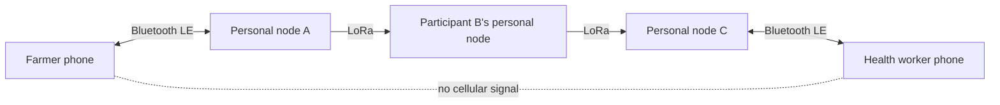
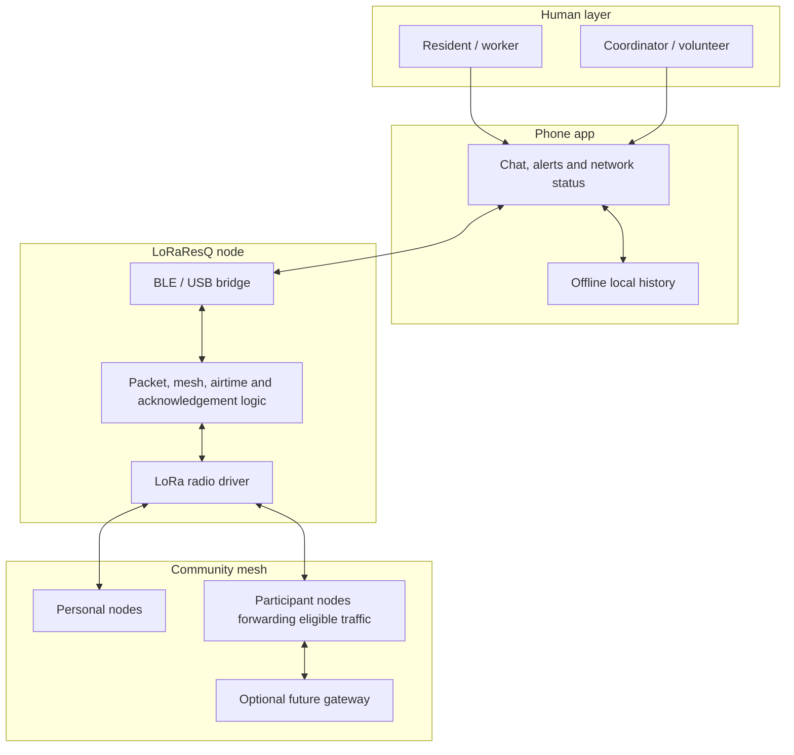
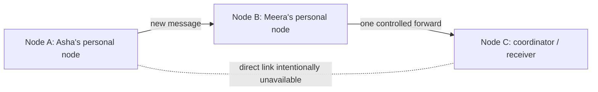
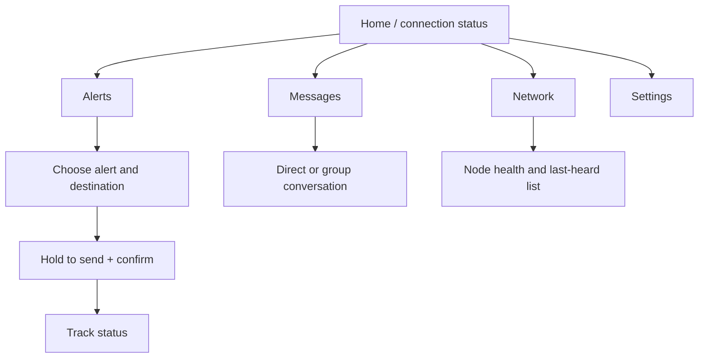
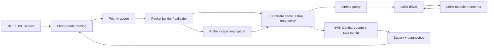
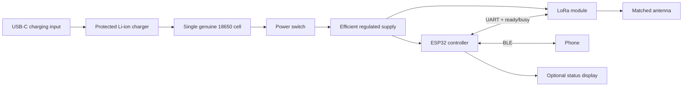

# LoRaResQ

## Rural resilience mesh — product and implementation blueprint

| Item | Decision |
|---|---|
| **Status** | Working blueprint — v1.0 |
| **Last revised** | 2 October 2026 |
| **Team** | Tanishq Mudaliar (team lead), Hrshita Balakrishnan, Saivel Konar, Selvanavya Thevar |
| **Mentor** | Dr. Namrata Jiten Patel |
| **Primary setting** | Rural and peri-rural India: hamlets, farms, forest-edge routes, shelters and disaster-affected localities |
| **Prototype** | Three interoperable personal nodes, each carried and used by a participant |
| **Budget ceiling** | ₹10,000, excluding tools borrowed from the college lab |
| **Competition** | Anveshana and comparable student-innovation events |

> **LoRaResQ is a low-cost, community-owned emergency messaging mesh that carries short texts and structured alerts between phones when mobile data, Wi-Fi and cellular coverage are unavailable, weak or disrupted.**

LoRaResQ belongs to the same family as [Meshtastic](https://meshtastic.org/): both use low-power LoRa radios to form an off-grid, decentralised mesh. It is not a new radio invention, nor a replacement for Meshtastic. Its purpose is to focus the proven LoRa-mesh model on a rural rescue and resilience workflow: local-language alerts, clear delivery status, safe radio defaults, inexpensive node roles and a deployment playbook for a school, panchayat, farm collective or volunteer group.

This document distinguishes between what the team will **demonstrate in the prototype** and what is a later **deployment direction**. That keeps the project credible and avoids promising a public-safety system before it has been tested and certified.

---

## Contents

1. [Problem and opportunity](#1-problem-and-opportunity)
2. [Product thesis, scope and limits](#2-product-thesis-scope-and-limits)
3. [People, scenarios and use cases](#3-people-scenarios-and-use-cases)
4. [Success measures](#4-success-measures)
5. [System and network design](#5-system-and-network-design)
6. [User-experience blueprint](#6-user-experience-blueprint)
7. [Product requirements](#7-product-requirements)
8. [Technical architecture](#8-technical-architecture)
9. [Radio, mesh and message protocol](#9-radio-mesh-and-message-protocol)
10. [Security, privacy and safety](#10-security-privacy-and-safety)
11. [Hardware and power blueprint](#11-hardware-and-power-blueprint)
12. [Flutter application plan](#12-flutter-application-plan)
13. [Build roadmap](#13-build-roadmap)
14. [Testing and field evidence](#14-testing-and-field-evidence)
15. [Pilot deployment playbook](#15-pilot-deployment-playbook)
16. [Compliance, ethics and operating limits](#16-compliance-ethics-and-operating-limits)
17. [Budget and risks](#17-budget-and-risks)
18. [Competition narrative](#18-competition-narrative)
19. [Decision log and next actions](#19-decision-log-and-next-actions)
20. [Glossary and references](#20-glossary-and-references)

---

# 1. Problem and opportunity

## 1.1 The gap

A phone is useful only while a cellular tower, backhaul, electricity and valid connection are working. That assumption fails where basic communication matters most:

- a farm, orchard, forest edge, trek route or fishing area sits beyond usable coverage;
- a flood, cyclone, fire, landslide or power cut disrupts normal networks;
- an event temporarily overloads the available cellular network; or
- volunteers need a local coordination channel before outside help arrives.

The need is not high-speed internet. It is the ability to say **“I need help,” “the road is blocked,” “meet at the school,”** or **“everyone is safe”** over a few kilometres without outside infrastructure.

## 1.2 Why LoRa

LoRa trades data speed for range and receiver sensitivity. A battery-powered node can send a small packet far beyond Bluetooth or ordinary Wi-Fi in favourable terrain. It is unsuitable for voice, video, photos, web browsing or continuous live tracking; it is well suited to short text, status and structured alerts.

LoRaResQ therefore treats radio airtime as scarce. Every feature must justify its use of the shared channel. A compact `MEDICAL_HELP` packet is more reliable than a long paragraph when the network is busy.

## 1.3 Why mesh

One link may be blocked by a hill, trees, walls or distance. A mesh lets eligible nodes forward a new packet, bridging the gap one hop at a time.



The forwarding node is **not** a cellular tower: it does not speak to SIM cards, provide internet, or require telecom backhaul. It is another participant's personal LoRaResQ node. When it receives an eligible new packet, it automatically forwards it while continuing to serve its owner's phone.

## 1.4 Responsible position

LoRaResQ can shorten the time between a local incident and the first useful message. It cannot guarantee delivery, dispatch an ambulance, replace 112 or operate as a certified life-safety system.

> **LoRaResQ is a community communication fallback that complements official emergency channels whenever they are available.**

---

# 2. Product thesis, scope and limits

## 2.1 Product promise

When normal connectivity is unavailable, a person with a paired LoRaResQ node can:

1. send a short message to a known community member;
2. broadcast a structured alert to the local mesh;
3. see whether the message was accepted by the local node, transmitted, and—where possible—acknowledged by a recipient; and
4. use another participant's personal node to reach people beyond one direct radio hop.

These core local functions need no SIM, cloud account, mobile tower, Wi-Fi or subscription.

## 2.2 Prototype commitments

| Capability | Prototype commitment |
|---|---|
| Three-node mesh | Yes: prove A → participant B's node → C when A and C cannot communicate directly. |
| Phone link | Bluetooth Low Energy first; Android USB serial is a debugging fallback. |
| Text messages | Yes: bounded-size messages with honest sent / relayed / acknowledged state. |
| Preset alerts | Yes: SOS, medical help, fire, flood, road blocked, all safe and meeting call. |
| Local language | Yes: labels and onboarding in English plus selected pilot-community languages. |
| Field evidence | Yes: real range, delivery and battery measurements. |
| Payload protection | Yes: use established authenticated encryption, never an invented cipher. |
| Airtime protection | Yes: account for time-on-air and queue traffic under a configured policy. |
| Personal-node enclosure | Basic enclosed prototype that can be safely carried and charged. |

## 2.3 Explicitly out of scope for version 1

- Voice, video, photos, internet access or social-media-style feeds.
- Guaranteed delivery, automated emergency-service contact or medical advice.
- Public, anonymous or city-scale networking.
- Continuous location tracking by default.
- Recipient-specific end-to-end private chat. That needs individual credential enrolment, revocation and review; it is a version-2 goal.
- Commercial sale or unattended public deployment before regulatory and safety work is complete.

## 2.4 Honest relationship to Meshtastic

Meshtastic already proves the value of affordable, low-power, encrypted and decentralised LoRa mesh communication. LoRaResQ should acknowledge that openly.

| Layer | Meshtastic reference | LoRaResQ focus |
|---|---|---|
| Network | General off-grid mesh | Small, purpose-configured local rescue mesh |
| Experience | Flexible chats, channels and device configuration | Alert-first, low-literacy-friendly emergency workflow |
| Deployment | Broad hardware ecosystem | Personal-node kit in which every participant node can forward eligible traffic |
| Localisation | Community-wide project | Pilot-community language, icons and operating terms |
| Compliance | Region-aware open-source platform | India-focused configuration record and conservative prototype policy |
| Proof | General off-grid communication | Measured local incident-coordination usefulness |

The strongest competition claim is: **“We turned a proven communication pattern into a buildable, testable rural emergency-response workflow.”**

---

# 3. People, scenarios and use cases

## 3.1 Primary users

| User | Need | LoRaResQ role |
|---|---|---|
| Farm or orchard worker | Raise an incident without walking to coverage | Personal node plus alert-first phone screen |
| Health worker / volunteer | Coordinate assistance across hamlets | Personal node and health-centre coordinator node |
| Forest-edge patrol or herder | Report danger in patchy coverage | Personal node; nearby participant nodes bridge a gap when available |
| Panchayat, school or shelter coordinator | Send area-wide instructions | Coordinator's personal node with trusted alert controls |
| Disaster-response volunteer | Re-establish basic local communication quickly | Portable personal nodes carried by the response team |
| Trek, pilgrimage or event organiser | Coordinate a contained group in congestion or low coverage | Temporary, named-group mesh |

## 3.2 Use-case catalogue

| Scenario | User action | Compact message | Mesh behaviour | Human response |
|---|---|---|---|---|
| **Medical help in a field** | Tap **Medical help**, add optional landmark | `MEDICAL_HELP` + note | Priority broadcast, bounded retry, coordinator acknowledgement requested | Named volunteer travels / escalates through normal service if possible |
| **Flood or rain warning** | Coordinator selects severity and safe location | `FLOOD_WARNING` + expiry | Community broadcast, relayed to outer nodes | Residents follow local shelter plan and check in |
| **Fire report** | Tap **Fire**, add landmark | `FIRE` + note | Priority broadcast, acknowledgement requested | Trained responder checks and contacts authorities when possible |
| **Route blocked** | Choose **Road blocked** | `ROUTE_BLOCKED` + route / landmark | Broadcast with expiry to avoid stale warning | Community takes alternate route; coordinator clears after verification |
| **Search coordination** | Coordinator creates compact task | `SEARCH_TASK` + sector / meeting point | Group message with acknowledgement | Human-led search; no automatic tracking claim |
| **Post-disaster check-in** | Tap **I am safe** | `CHECK_IN` | Small broadcast with strict repeat limit | Coordinator roster records check-in; silence is not proof of danger |
| **Meeting or shelter instruction** | Coordinator chooses **Assemble** | `ASSEMBLE` + location / time | Broadcast with timestamp and expiry | Residents go to the announced point |
| **Farm / equipment incident** | Send text or preset | `ASSISTANCE_NEEDED` + note | Normal-priority direct or group message | Nearby worker responds |
| **Forest-edge hazard** | Report observed danger | `HAZARD` + landmark | Group broadcast through participant nodes that hear it | Team changes route / notifies responsible authority |
| **Event staff call** | Organiser summons stewards | `STAFF_CALL` + zone | Named-group alert | Event team handles its own procedure |

## 3.3 Alert design rules

1. A preset describes an action, not merely an emotion.
2. Every critical action uses icon plus local-language label.
3. Hold-to-send or confirmation prevents accidental high-impact alerts.
4. Each warning has an expiry; old hazards must not circulate forever.
5. Do not broadcast personal medical records, Aadhaar details or other sensitive data.
6. Never say “help is coming” unless a named human explicitly confirms that.

## 3.4 End-to-end example

**Asha is injured near an orchard; her phone has no mobile signal. Ravi is at the health centre. Meera, another worker, is between them and is carrying her own LoRaResQ node.**

1. Asha opens LoRaResQ and long-presses **Medical help**.
2. Her app adds an optional landmark, then sends the alert to Node A by BLE.
3. A displays **Queued for radio**, then **Sent to mesh** after it transmits.
4. Meera's Node B validates the new packet, waits a short random interval and forwards it once without interrupting Meera's own use of the node.
5. Node C delivers the alert to Ravi’s phone; Ravi sends an acknowledgement.
6. Only when the acknowledgement returns does Asha see **Acknowledged by Ravi**.
7. Ravi follows the actual community response plan. The app never pretends it dispatched help automatically.

---

# 4. Success measures

## 4.1 Evidence of a successful prototype

| Outcome | Evidence |
|---|---|
| New user can send an alert | Supervised usability participant completes it unaided in under 30 seconds. |
| Mesh extends reach | A → C fails directly; A → B → C succeeds repeatedly. |
| Status is honest | UI distinguishes accepted, queued, sent and acknowledged. |
| Messages fit LoRa | Payload limit, packet loss and capacity constraints are visible and documented. |
| Relevant terrain is tested | Open and obstructed field tests are logged. |
| Radio policy is deliberate | Saved configuration, frequency record, power record and airtime logs exist. |
| Hardware is safe to demonstrate | Protected charging, antenna attached before transmission and insulated enclosure. |

## 4.2 Target metrics

These are engineering targets, not untested marketing claims.

| Metric | Target | Measurement |
|---|---:|---|
| Two-node bench reliability | 100 / 100 short messages | Five-metre controlled test |
| Three-node forwarding reliability | 20 / 20 attempts | Direct link unavailable; participant B's node active |
| Alert interaction time | ≤ 30 seconds | New-user usability test |
| Outdoor range | Report actual result | GPS-tagged / mapped trials in stated terrain |
| Battery life | Report actual runtime | Fixed workload and known cell condition |
| Duplicate UI delivery | Zero duplicates | Triangle-topology test |
| Airtime policy | No breach in stress test | Firmware queue and time-on-air logs |

## 4.3 Truth-in-pitch rules

- Never turn a seller’s open-field range quote into a guarantee.
- Never call a packet “delivered” because the sender’s node accepted it.
- Never call a participant node a “tower” or LoRaResQ an internet replacement.
- Never claim individual private chat until that cryptographic design exists and is reviewed.
- Never imply regulatory approval without proof.

---

# 5. System and network design

## 5.1 Four layers



1. **Human:** decides what action is needed.
2. **Phone:** makes the radio system usable through icons, language and visible delivery state.
3. **Node:** bridges phone data to LoRa and protects the shared channel.
4. **Mesh:** personal nodes forward eligible messages within a small community area. Forwarding is a behaviour of each node, not a separate infrastructure role.

## 5.2 Network roles

| Role | Owner | Job | Hardware emphasis |
|---|---|---|---|
| **Personal node** | Worker, volunteer, resident | Pairs to its owner's phone and can forward eligible traffic | Battery, compact enclosure, simple antenna |
| **Forwarding participant** | Any active node owner between sender and recipient | Automatically bridges a new eligible message while using their own node | The same personal-node hardware; no dedicated relay device |
| **Coordinator** | Named community steward | Receives and acknowledges selected alerts from their personal node | Personal-node hardware plus trusted app controls |
| **Future gateway** | Trusted organisation | Bridges selected traffic outward when connectivity exists | Wi-Fi / Ethernet / cellular; never required for local mesh |

All version-1 nodes are personal nodes. “Forwarding participant” describes what a node does for a specific packet; it is not a different product, a fixed installation or proof of stronger radio capability.

## 5.3 Minimum viable topology



Two nodes prove a radio link. Three nodes prove the product: a third participant's personal node bridges a real communication gap.

## 5.4 Participant coverage method

Walk the actual routes where people work, travel and coordinate. Mark homes, fields, tree cover, hills, buildings and likely coverage gaps. Test with nodes carried at actual user height and note where a participant naturally becomes the bridge between two others. The prototype should prove useful movement-based coverage, not rely on an assumed fixed installation.

## 5.5 Community operating rules

Agree before a pilot:

1. Who may send high-priority public alerts?
2. Who carries, charges and checks each personal node?
3. What does each alert mean locally, and who responds?
4. How is a lost node removed and its credentials handled?
5. How long is app history retained?
6. What is the fallback when nobody acknowledges?

A radio mesh is only as useful as the people and procedure around it.

---

# 6. User-experience blueprint

## 6.1 Principles

- **Emergency action before configuration.** Alerts are first-class, not buried inside chat.
- **Offline-first.** No account and no cloud round-trip for core local messaging.
- **Plain language.** Say “No acknowledgement yet,” not “ACK timeout.”
- **Visible uncertainty.** Radio packets can be delayed or lost; the app shows what it knows.
- **Accessible under stress.** Large targets, high contrast, icons plus words and meaningful vibration / sound controls.
- **Local language is safety.** Critical labels and confirmations must be reviewed by actual users.
- **Privacy by restraint.** Ask for no data the action does not need.

## 6.2 App navigation



## 6.3 Required screens

| Screen | Purpose | Must show |
|---|---|---|
| Home | Confidence that local node is usable | Connected / disconnected, battery, last activity and Alert entry point |
| Alerts | Action-oriented preset sending | Large buttons, short description, confirmation and optional compact note |
| Messages | Ordinary short text | Destination / group, length limit and status timeline |
| Alert detail | Accurate state | Type, sender, time, expiry and acknowledgement identity if received |
| Network | Basic health | Own battery, recent peers, last-heard time and which participant nodes are currently reachable |
| Onboarding | Pair phone with personal node | Permission explanation, connection guide, language and safety disclaimer |
| Coordinator tools | Trusted users only | Acknowledge, clear / expire warning and compact roster status |
| Settings | Safe user preferences | Language, display name and notification preferences; hide radio configuration |

## 6.4 Message status contract

| State | Meaning |
|---|---|
| **Draft** | Still on the phone. |
| **Accepted by node** | BLE / USB transfer to the paired node succeeded. |
| **Queued for radio** | Waiting for permitted airtime. |
| **Sent to mesh** | Local radio transmitted; another device may or may not have heard it. |
| **Relayed** | Optional diagnostic state reported by another node. |
| **Acknowledged** | Intended recipient or authorised coordinator sent a matching acknowledgement. |
| **Expired / not acknowledged** | Retry and expiry policy ended without proof of receipt. |

The app must never skip to a later state without evidence.

## 6.5 Failure wording

| Condition | User-facing text |
|---|---|
| Node disconnected | “Your LoRaResQ node is disconnected. Move closer, switch it on or reconnect.” |
| Radio queue occupied | “Message is waiting for a safe radio slot.” |
| No acknowledgement | “Sent to the mesh; no acknowledgement yet. Use an official emergency channel if available.” |
| Low battery | “Node battery is low. Charge before relying on it.” |
| Message too long | “Keep the message under 120 characters so it can travel reliably.” |

---

# 7. Product requirements

## 7.1 Functional requirements

| ID | Requirement | Priority | Acceptance evidence |
|---|---|---|---|
| FR-01 | Pair one phone with one node over BLE. | Must | Reconnect after app restart unless user removes node. |
| FR-02 | Send short text to known node or group. | Must | Two-node and three-node tests pass. |
| FR-03 | Send preset alerts with optional note. | Must | Receiving phone renders accurate alert. |
| FR-04 | Forward an eligible new packet at most once per personal node. | Must | Bounded forwarding; no duplicate UI delivery. |
| FR-05 | Limit hops and expire old packets. | Must | Packet stops at configured policy. |
| FR-06 | Suppress duplicates after overlap / reboot. | Must | One visible delivery per message ID. |
| FR-07 | Request and display acknowledgement. | Must | UI changes only after matching ACK. |
| FR-08 | Provide battery and basic node status. | Should | Visible on Home / Network screens. |
| FR-09 | Keep history locally without internet. | Should | Airplane-mode persistence test. |
| FR-10 | Let authorised coordinator clear expired broadcast warning. | Should | Authenticated clear shown in history. |

## 7.2 Non-functional requirements

| ID | Requirement | Rule |
|---|---|---|
| NFR-01 | Reliability | Measure and report; never claim a fixed delivery rate beyond tested conditions. |
| NFR-02 | Usability | New user sends preset alert in ≤ 30 seconds. |
| NFR-03 | Capacity | Short messages only; UI enforces payload budget. |
| NFR-04 | Security | Standard authenticated encryption; reject malformed / unauthenticated input. |
| NFR-05 | Privacy | No cloud account; location is opt-in and off by default. |
| NFR-06 | Maintainability | Version all phone-node and radio packet formats. |
| NFR-07 | Power | Measure runtime under defined workload and show low-battery warning. |
| NFR-08 | Compliance | Region, frequency, power and airtime profile protected from casual change. |
| NFR-09 | Safety | Correct antenna fitted; protected battery charging; insulated enclosure. |

---

# 8. Technical architecture

## 8.1 Recommended prototype stack

| Layer | Choice | Rationale |
|---|---|---|
| Phone app | Flutter / Dart | This repository is already Flutter; one codebase supports target platforms. |
| Phone-node transport | BLE; USB serial for Android development | BLE is normal user flow; serial is invaluable for debugging. |
| Controller | ESP32 development board | Low-cost, familiar, BLE-capable and well documented. |
| Radio | 865–868 MHz-capable LoRa module such as EBYTE E22-900 family | Can be configured for an Indian short-range-band profile subject to compliance verification. |
| Firmware | C++ on PlatformIO / Arduino core; ESP-IDF if stronger control is needed | Fast path to testable hardware; keep modules separable. |
| Storage | Phone: SQLite / Drift or Hive; node: NVS / preferences | Local mesh remains useful without server. |
| Cryptography | Maintained ESP32-supported library such as mbedTLS | Never use homemade cryptography or radio “key” scrambling as security. |

## 8.2 Firmware modules



| Module | Responsibilities |
|---|---|
| Radio driver | Configure radio, respect ready / busy signal, send / receive bytes and expose signal diagnostics where supported. |
| Phone-node framing | Split BLE payloads, validate frame length and version every command. |
| Packet layer | Construct compact packet; validate version, length, expiry and integrity. |
| Mesh service | Recent-seen cache, hop limit, controlled delay, cancellation, retries and acknowledgements. |
| Airtime service | Estimate time-on-air before transmit; enforce community policy. |
| Crypto service | Encrypt / authenticate application payloads and persist counters safely. |
| Storage service | Persist identity, safe config and bounded diagnostics, never unlimited history. |
| Status service | Battery, radio availability, peer count and errors for the app. |

## 8.3 Phone-to-node protocol

The protocol is identical over BLE and USB, versioned and length-bounded. Use compact structured binary framing (for example CBOR or protobuf-nano), not fragile ad-hoc strings.

| Command / event | Direction | Required data |
|---|---|---|
| `HELLO` | Both | Protocol version, capabilities and node ID |
| `SEND_TEXT` | Phone → node | Destination / group, text and request-ACK flag |
| `SEND_ALERT` | Phone → node | Alert type, optional note, expiry and priority |
| `MESSAGE_RECEIVED` | Node → phone | Packet ID, type, sender, display payload, hops and timestamp |
| `STATUS_CHANGED` | Node → phone | Packet ID, state and reason / acknowledgement ID |
| `NODE_STATUS` | Node → phone | Battery, radio state, queue depth and last activity |
| `CONFIG_READ` | Phone → node | Requested safe configuration fields |
| `CONFIG_WRITE` | Phone → node | Authorised changes only |

Every frame has a maximum length, protocol version and type. Unknown critical fields or oversized frames are rejected without crashing the node.

## 8.4 Repository direction

The existing Flutter project is a clean starter. Build it in layers rather than putting UI, BLE and business rules in `main.dart`.

```text
lib/
  app/                 # app shell, routing, theme, localisation
  core/                # errors, constants, result types
  domain/              # Message, Alert, NodeStatus and use cases
  data/                # BLE transport, local persistence, protocol codec
  features/
    onboarding/
    home/
    alerts/
    messages/
    network/
    settings/
  shared/              # reusable widgets and accessibility helpers
firmware/
  src/
  include/
  test/
docs/
  protocol.md
  field-test-template.md
  deployment-checklist.md
```

Add each area when work begins; empty folders are not progress.

---

# 9. Radio, mesh and message protocol

## 9.1 Operating assumptions

- Small, low-traffic community mesh—not a continuous-data network.
- Every packet can collide, be delayed or be lost.
- Coverage depends on terrain, antenna height, foliage, buildings, rain and installation quality.
- Radio hardware must use a deliberate local profile, never a generic foreign-region default.

## 9.2 Packet classes

| Class | Examples | Forwarded? | ACK? | Priority |
|---|---|---:|---:|---:|
| Control | Join / configuration confirmation | Limited, authorised only | Usually | High |
| Alert | Medical, fire, flood, hazard | Yes, within policy | Yes | High |
| Direct text | “Pump failed; need help” | Until destination / TTL ends | Optional | Normal |
| Group text | Work-group message | Within group policy | Optional | Normal |
| Check-in | “All safe” | Strict repeat limit | Coordinator optional | Low |
| Telemetry | Battery / heartbeat | Off by default or low rate | No | Low |

## 9.3 Conceptual packet format

The exact byte-level form belongs in `docs/protocol.md` before app and firmware implement independently.

| Field | Purpose |
|---|---|
| Version + flags | Safe format evolution, priority and ACK request |
| Network ID | Keeps independent communities apart |
| Message ID | Duplicate suppression and UI status matching |
| Source ID | Stable node identity, distinct from editable display name |
| Destination / group | One node, group or community broadcast |
| Type | Text, alert, acknowledgement, status or control |
| Hop limit | Reduced at each forward to stop endless propagation |
| Created time + expiry | Prevents stale alerts circulating |
| Payload length + payload | Bounded encrypted content |
| Nonce + authentication tag | Confidentiality, integrity and replay resistance |

## 9.4 Controlled-flooding rule

```text
when radio packet arrives:
    reject if malformed, expired, unauthenticated or from wrong network
    reject if (source ID, message ID) is in recent-seen cache
    store message ID in cache

    if addressed to this node, subscribed group or community:
        deliver to paired phone
        send acknowledgement if policy requires one

    if forwarding is permitted and hop limit remains:
        decrement hop limit
        schedule one short random delay
        cancel if same packet is heard forwarded first
        transmit only when airtime policy permits
```

Guardrails:

- A node forwards one new valid message once, never indefinitely.
- Recent-seen entries expire after a defined window but survive the active packet storm.
- A small hop limit is chosen from field measurement; more hops consume more radio capacity.
- Retries retain the same message ID or duplicate suppression fails.
- Only a destination or authorised coordinator acknowledges; intermediate forwarding nodes do not pretend receipt.

## 9.5 Airtime and capacity

LoRa range is purchased with airtime. Slower settings may rescue a weak link but make every packet occupy the channel longer; every participant node that forwards it repeats that occupancy. Firmware calculates or conservatively estimates time-on-air before transmission.

The user-visible policy is simple:

- normal messages are short and rate-limited;
- alerts are prioritised but still bounded;
- telemetry is rare or off;
- no arbitrary data streams enter the mesh; and
- a queued message is explained rather than silently dropped.

## 9.6 Range statement

Before testing, the only defensible claim is:

> **LoRaResQ is designed for kilometre-scale links in favourable conditions and for extending local reach through other participants' nodes; actual coverage is measured per terrain, movement and installation.**

The most effective improvements are usually better participant placement along the route, an additional participant node in the gap, antenna height where appropriate, careful modem settings, and only then transmit power within the applicable rules.

---

# 10. Security, privacy and safety

## 10.1 Version-1 security promise

The first prototype may use one carefully managed **community network key** with standard authenticated encryption. It protects messages from casual listeners without that key and rejects basic tampering. It does **not** mean every authorised member is cryptographically unable to read another member’s direct message.

Individual end-to-end privacy needs per-recipient keys, key enrolment, revocation, recovery and a review. Do not promise it in version 1.

## 10.2 Security controls

| Concern | Version-1 control | Later hardening |
|---|---|---|
| Eavesdropping | Authenticated encryption with community key | Recipient-specific E2E encryption |
| Tampering | Verify authentication tag before display / forward | Signed coordinator commands |
| Replay | Message IDs, nonce discipline, expiry and duplicate cache | Persistent replay windows |
| Lost device | Remove / re-enrol process; rotate community key if exposed | Per-device revocation list |
| Impersonation | Stable node identity and authenticated packet | Hardware-backed credential where feasible |
| Bad configuration | Protected local region / transmit policy | Signed configuration profile |

## 10.3 Privacy rules

- No cloud account or contact-book upload is needed for local v1 messaging.
- Location is opt-in and disabled by default.
- Store only operational history needed by the user; provide clear-history control.
- Logs use packet IDs and radio outcomes, not plaintext messages.
- Do not transmit sensitive personal information through a community broadcast.

## 10.4 Safe interface language

| Avoid | Use |
|---|---|
| “Emergency services notified” | “Alert sent to local LoRaResQ mesh” |
| “Delivered” after transmit | “Sent to mesh” |
| “Rescue confirmed” | “Acknowledged by <name>” |
| “Private chat” | “Community-encrypted message” until E2E exists |

---

# 11. Hardware and power blueprint

## 11.1 Hardware philosophy

Choose locally available, documented and debuggable parts. Do not optimise v1 for the smallest board or highest claimed range. A stable three-node mesh is worth more than a high-power module that nobody can configure safely.

## 11.2 Node architecture



| Subsystem | Prototype selection | Rule |
|---|---|---|
| Controller | ESP32 development board | Reliable USB interface and exposed UART pins |
| Radio | 865–868 MHz-capable E22-900-class module or comparable | Verify exact range, voltage, interface and manual before purchase |
| Antenna | Matched 868/915-class antenna | Never transmit without it; confirm connector gender |
| Battery | Genuine single 18650 Li-ion | Reject implausible “9900 mAh” cells and damaged cells |
| Charging | USB-C board with over-charge, over-discharge and short-circuit protection | Follow manufacturer load connection exactly |
| Regulator | Efficient 3.3 V or designed power path | Avoid wasteful multi-stage conversion in final build |
| Enclosure | Insulated plastic prototype case | Protect battery and wiring from short circuits |
| OLED | Optional I²C display | Helpful for demo and diagnostics, not core mesh proof |

## 11.3 ESP32 ↔ radio wiring pattern

Exact pins differ by module and board; the manufacturer manual is authoritative.

| Radio signal | Example ESP32 connection | Purpose |
|---|---|---|
| VCC | Exact regulated voltage stated by module datasheet | Power |
| GND | Common ground | Reference |
| TXD | Hardware UART RX | Radio-to-controller data |
| RXD | Hardware UART TX | Controller-to-radio data |
| M0 / M1 | Two safe output GPIO pins | Normal / configuration / sleep mode |
| AUX / BUSY | Safe input GPIO | Radio ready / busy indication |
| Antenna | Correct matched antenna | RF path |

Before first transmission:

1. Verify supply voltage and logic levels for the exact revision.
2. Fit the correct antenna securely.
3. Verify TX/RX crossover and common ground.
4. Measure regulator output before connecting logic or radio.
5. Save and read back the radio configuration.
6. Begin on a supervised bench at conservative settings.

## 11.4 Battery safety and measurement

- Use protected charging, genuine cells and insulated enclosures.
- Set adjustable regulators before attaching electronics.
- Supervise early charges; stop using swollen, punctured or hot cells.
- Strain-relieve wires; loose battery leads are unacceptable.
- Measure idle, receive and transmit current.

Battery result format: **“X hours under a defined workload”**, including cell condition, BLE state, radio state, payload rate, screen state and temperature—not a universal battery-life claim.

## 11.5 Personal-node carry guidance

Every version-1 node is carried by a person. After core proof, improve each device for that reality: weather-resistant but serviceable enclosure, protected charging port, secure antenna connection, lanyard or belt attachment, drop resistance, clear battery indication and a named owner. Do not add fixed infrastructure, pole mounting or solar charging to the prototype scope.

---

# 12. Flutter application plan

## 12.1 Delivery order

1. LoRaResQ app shell, theme and offline mock data.
2. Pairing / connection state behind a transport abstraction.
3. Message model and delivery-state timeline.
4. Alert-first flow with language labels.
5. Real BLE transport against a node.
6. Local persistence and reconnection.
7. Network health and coordinator acknowledgements.
8. Accessibility, error states, test logging and visual polish.

Use a deterministic fake transport early so user flows are testable before firmware is complete. Replace it with BLE at the repository boundary, not inside screen widgets.

## 12.2 Domain models

| Model | Important fields |
|---|---|
| `MeshMessage` | ID, source, destination / group, body, time, expiry, state, hops, acknowledgement |
| `MeshAlert` | Alert kind, severity, compact note, location-consent flag, sender, expiry, status |
| `NodeStatus` | Node ID, display name, connection state, battery, radio availability, last-heard time |
| `Peer` | Node ID, role, last seen, signal indicator, optional hop estimate |
| `MeshConfig` | Region profile, safe user settings, language, trusted coordinator IDs |
| `DeliveryEvent` | Message ID, state transition, timestamp and machine-readable reason |

## 12.3 Transport boundary

```dart
abstract interface class NodeTransport {
  Stream<NodeEvent> get events;
  Future<void> connect(NodeIdentifier node);
  Future<void> send(NodeCommand command);
  Future<NodeStatus> readStatus();
  Future<void> disconnect();
}
```

Exact names may change; the architectural rule does not: a feature screen never decodes a BLE characteristic itself.

## 12.4 Accessibility acceptance checks

- Critical alerts have icon, text and semantic label.
- Colour state is always accompanied by words.
- Touch targets are comfortably sized.
- One alert flow is reviewed by a speaker of every launch language.
- A non-team user understands disconnection and no-acknowledgement states.
- Core app flow works with internet disabled.

---

# 13. Build roadmap

## 13.1 Workstreams

| Workstream | Accountable role | First deliverable |
|---|---|---|
| Hardware / power | Hardware lead | Safely powered, documented node |
| Firmware / protocol | Firmware lead | Two-node serial-to-radio link |
| Flutter product experience | App lead | Fake-transport alert and status flow |
| Field evidence / compliance | Test-research lead | Test template, configuration record and risk checklist |
| Pitch / deployment | Team lead with all members | Demo narrative and topology diagram |

## 13.2 Ten-week plan

| Week | Milestone | Exit criterion |
|---:|---|---|
| 1 | Scope lock and procurement | Exact module, power path and pilot scenario chosen; parts ordered. |
| 2 | Safe bench nodes | Two nodes power safely, serial works and config is readable. |
| 3 | Point-to-point radio | 100 controlled short-message attempts logged. |
| 4 | App connection shell | Flutter app connects to simulator or node and shows status. |
| 5 | Three-node forwarding | A → B → C succeeds where direct A → C fails. |
| 6 | Alerts and delivery states | Alert works end-to-end and distinguishes send from ACK. |
| 7 | Airtime and security baseline | Queue limits, malformed-packet rejection and community-key protection demonstrated. |
| 8 | Outdoor measurements | Range, delivery, placement and battery results captured. |
| 9 | Usability and packaging | Non-team user test, enclosure and quick-start card complete. |
| 10 | Competition hardening | Full rehearsal and evidence table complete. |

## 13.3 Scope gates

| Gate | Decision |
|---|---|
| End of week 3 | If two-node radio is unreliable, pause app polish and fix power / firmware / configuration. |
| End of week 5 | If forwarding is unstable, reduce scope before adding GPS, maps, cloud or animations. |
| End of week 7 | If key handling is not robust, state controlled-demo limitation rather than claim strong security. |
| End of week 8 | Only measured range and battery figures may appear in the pitch. |

Do not build solar charging, a GPS map, cloud dashboard, custom PCB or voice features before the core proof exists.

---

# 14. Testing and field evidence

## 14.1 Test discipline

Each test record names firmware and app build, radio profile, antenna, node role, location / terrain, weather, distance method, payload length, attempts, received count and observed failures. One successful desk message is a demo moment, not evidence.

## 14.2 Acceptance table

| Test | Method | Pass condition | Save |
|---|---|---|---|
| Configuration read-back | Read every node’s actual radio config | Each matches approved profile | Serial log / screenshot |
| Bench link | 100 messages at five metres | 100 correctly decoded | Timestamped log |
| BLE bridge | Phone sends and receives through one node | Reconnect and operation work after app restart | Screen recording + logs |
| Multi-hop | A and C cannot communicate directly; participant B carries an active node between them | 20 / 20 controlled attempts delivered once | Direct-failure / participant-forwarding-success record |
| Duplicate suppression | Triangle topology | One visible delivery per message ID | Packet and UI logs |
| Hop limit | Chain longer than TTL where feasible | Packet stops at policy | Serial log |
| Acknowledgement | C receives ACK-requested message | A changes state only after C ACK | Timeline recording |
| Alert usability | New participant sends medical-help alert | Completes within target unaided | Consent-based observation sheet |
| Malformed packet | Test invalid / oversized input | No crash, display or forward | Firmware test result |
| Airtime stress | Sustained normal load | Queue enforces policy | Airtime / queue log |
| Battery | Defined workload from full charge | Runtime recorded with conditions | Current and runtime sheet |

## 14.3 Range-test method

1. Choose safe, legal locations with permission.
2. Fix one node at realistic installation height and carry the other at realistic user height.
3. Fix payload and radio profile for a test run.
4. At set intervals, attempt a fixed message count in both directions.
5. Record distance, terrain, antenna height, weather, received count and diagnostics.
6. Repeat in open and obstructed / built / vegetated terrain.
7. Report the farthest distance meeting the delivery threshold, including failures.

| Date / time | Test ID | Node builds | Radio profile | Terrain | Distance | Attempts | Received | RSSI / SNR | Notes |
|---|---|---|---|---|---:|---:|---:|---|---|
|  |  |  |  |  |  |  |  |  |  |

## 14.4 Competition mesh proof

1. With participant B's node switched off or out of the route, show A cannot reach C.
2. Have participant B carry their powered personal node to the intermediate location.
3. Send A → C and show a unique message arrival through B's node.
4. Send a medical-help preset and show named acknowledgement.
5. Explain that B's ordinary personal node extends a local radio mesh; do not call it a tower.

---

# 15. Pilot deployment playbook

## 15.1 Start small

Begin with a supervised micro-pilot: a school campus plus adjoining field, farm collective or volunteer group. Do not start with a whole village and a promise of blanket coverage.

## 15.2 Pre-deployment checklist

- [ ] Community partner, site owner and node owners approve the pilot.
- [ ] Team confirms current regulatory requirements for actual location and configuration.
- [ ] Every node has recorded ID, firmware, radio profile and responsible person.
- [ ] Every participant has a safely enclosed, charged personal node and understands forwarding is automatic for eligible traffic.
- [ ] Alert meanings, coordinator names and fallback actions are explained.
- [ ] Participants understand it is best-effort and complements official services.
- [ ] Lost-device and key-rotation procedure is ready.
- [ ] Test route, privacy method and participant consent are approved.

## 15.3 Operating cadence

| Cadence | Activity |
|---|---|
| Daily during pilot | Participants check battery and connection status before entering the coverage area. |
| Weekly | Inspect personal-node enclosure, antenna, battery and charging cable. |
| Monthly | Run compact alert drill, review incidents and delete unneeded history. |
| Lost device | Remove from roster and rotate shared key if exposure is plausible. |
| Major incident | Confirm which participants are active and where they are before assuming a forwarding path exists. |

## 15.4 Printed quick-start card

1. Charge node, attach antenna and switch it on.
2. Open LoRaResQ and wait for **Node connected**.
3. For urgent local help, select **Alerts**, choose the icon and hold to send.
4. Read state: **Sent to mesh** is not **Acknowledged**.
5. Use 112 or another official contact whenever normal connectivity exists.
6. Do not send private personal information in a community broadcast.

---

# 16. Compliance, ethics and operating limits

## 16.1 India radio-compliance posture

This is a student prototype, not legal advice or certification. Before buying in bulk, extended outdoor testing, import, sale or public deployment, verify the current rules with official Wireless Planning & Coordination / Department of Telecommunications sources for the **exact** radio, frequency, bandwidth, transmit power, antenna and purpose.

The engineering posture is conservative and auditable:

- select hardware capable of the approved Indian range rather than use a US 915 MHz default;
- lock and read back a documented country profile on every node;
- start at conservative power and reduce / stop if interference or uncertainty arises;
- calculate / record airtime and enforce an appropriate transmit policy;
- use matched antennas and account for effective radiated power;
- stop or relocate if harmful interference occurs; and
- seek appropriate approval / certification advice before commercialisation or persistent public operation.

## 16.2 Ethics

| Topic | Policy |
|---|---|
| Emergency claims | Communication aid, never emergency-service replacement. |
| Privacy | Minimum data; location opt-in; no sensitive records in broadcast. |
| Equity | Test language, icons and workflow with intended users, not only technical peers. |
| Governance | Community owns alert meaning, participant orientation and access decisions. |
| Misuse | Limit high-priority controls and define revocation process. |
| Safety | Never ask people to enter unsafe areas merely to test range. |

## 16.3 Environmental responsibility

Use rechargeable cells safely, dispose of damaged batteries correctly, prefer labelled repairable prototypes and obtain permission before organised field tests on another person's property.

---

# 17. Budget and risks

## 17.1 Three-node estimate

Re-check all pricing with Indian suppliers before purchase.

| Item | Qty | Target unit (₹) | Estimated total (₹) | Notes |
|---|---:|---:|---:|---|
| ESP32 development board | 3 | 450 | 1,350 | Reliable USB preferred |
| 865–868 MHz-capable LoRa module | 3 | 850 | 2,550 | Confirm exact variant and voltage |
| Matched compact antenna | 3 | 250 | 750 | Confirm whether module includes one |
| Genuine 18650 cell | 3 | 300 | 900 | Real capacity, reputable source |
| Protected charger, regulator, holder, switch, capacitors | 3 sets | 220 | 660 | Validate power path |
| Enclosures, wire, headers, perfboard | 3 sets | 250 | 750 | Prototype protection |
| Optional OLED displays | 3 | 200 | 600 | Helpful, not core |
| Cables, connectors and test consumables | lot | — | 400 | Keep spare debugging parts |
| Shipping / contingency | — | — | 1,200 | Prices change |
| **Estimated total** |  |  | **₹9,160** | Limited buffer under ₹10,000 |

## 17.2 Spend order

1. Confirm exact radio, voltage and power design.
2. Validate two boards, two radios and safe power path.
3. Acquire the third personal node once the core stack is confirmed, unless shipping makes one order safer.
4. Borrow lab tools before spending budget on them.
5. Defer GPS, solar, custom PCB and premium enclosure until mesh proof exists.

## 17.3 Risk register

| Risk | Likelihood | Impact | Mitigation | Decision trigger |
|---|---:|---:|---|---|
| Real range below a listing claim | Medium | High | Measure early; improve antenna height / placement before power | Field report |
| Wrong region / default radio setting | Medium | High | Datasheet review, read-back profile, peer check | Before outdoor test |
| Battery damage | Low–medium | High | Protected charging, genuine cells, supervision | Stop on heat / swelling |
| Channel congestion | Medium | Medium | Small payloads, queueing, limited forwarding, no telemetry flood | Stress logs degrade |
| Bench succeeds but field fails | Medium | High | Test actual participant routes early; adjust spacing and movement; report limits | Week 8 |
| BLE pairing trouble | Medium | Medium | Reconnection flow and serial debug fallback | User-test failures |
| Protocol drift | Medium | Medium | Versioned spec and test vectors | Any incompatibility |
| Security overclaim | Medium | High | State v1 community-key limits | Pitch review |
| Forwarding participant unavailable | Medium | Medium | Show reachable-peer status, teach users to change position or wait for another participant, carry a spare node | Missed check-in |
| Feature creep | High | High | Scope gates; three-node proof before extras | Weekly review |
| Regulatory misunderstanding | Medium | High | Official sources and qualified advice for real deployment | Before public / sale |

---

# 18. Competition narrative

## 18.1 Three-sentence pitch

When mobile coverage is weak, overloaded or disrupted, a person may be unable to send even a basic request for help. LoRaResQ is a low-cost, community-owned mesh of personal radio nodes that lets nearby phones exchange short messages and emergency alerts without a SIM, internet or cellular tower. Inspired by the proven LoRa-mesh model used by Meshtastic, it focuses on rural emergency workflows: local-language preset alerts, participant-assisted forwarding, measured field evidence and honest delivery status.

## 18.2 Demonstration story

| Beat | What judges see |
|---|---|
| Problem | A phone with no cellular service cannot send normal app messages. |
| Connection | Phone connects by BLE to a pocket LoRaResQ node. |
| Mesh proof | A cannot reach C directly; B's ordinary personal node makes the message arrive. |
| Rescue workflow | Medical / flood / fire preset has clear information, expiry and state tracking. |
| Responsibility | Acknowledgement is not a rescue guarantee; official channels remain primary when available. |
| Evidence | Measured results, budget, radio-profile record and usability test. |

## 18.3 Three-minute script

1. **0:00–0:25:** Phone in airplane mode: “Without a network, an ordinary app cannot help.”
2. **0:25–0:50:** Show paired LoRaResQ node, battery and connection state.
3. **0:50–1:20:** With participant B's personal node off or out of position, show A cannot reach C.
4. **1:20–1:50:** Have B enter the intermediate position with their own node and show A → B → C delivery.
5. **1:50–2:20:** Send medical-help alert; C acknowledges; A shows the named acknowledgement.
6. **2:20–2:45:** “Meshtastic proves the LoRa mesh category. Our contribution is the rural rescue layer: preset actions, local-language clarity, participant-assisted forwarding and India-aware controls.”
7. **2:45–3:00:** “Text and alerts only; best-effort; complements official emergency channels.”

## 18.4 Likely questions

| Question | Concise answer |
|---|---|
| “Isn’t this Meshtastic?” | “It uses the same proven category. We are building a focused rural emergency workflow and deployment model, not claiming to invent LoRa mesh.” |
| “Why not 4G / 5G?” | “Use them whenever available. LoRaResQ is for local gaps and outage conditions.” |
| “Why not satellite?” | “Satellite reaches farther but costs more and often requires subscription. Ours is local and community-operated.” |
| “What range?” | “Here are measured results for this terrain and antenna placement. We do not claim universal range.” |
| “Is it legal?” | “We document a local profile and conservative prototype policy; current WPC / DoT requirements must be verified before deployment or sale.” |
| “Can it call an ambulance?” | “No. It alerts the local mesh; people use official services whenever available.” |
| “How secure?” | “V1 protects community traffic with authenticated encryption. We do not claim individual E2E chat before building it.” |

---

# 19. Decision log and next actions

## 19.1 Decisions made

| Decision | Why |
|---|---|
| Build three nodes | Only three nodes prove that one participant's personal node can bridge two others. |
| Phone plus personal radio node | Familiar UI paired with off-grid radio link. |
| Flutter app | Existing repository already uses Flutter. |
| Controlled flooding first | More achievable and inspectable than route discovery. |
| Alert-first, text-only | Matches LoRa capacity and emergency usability. |
| Treat Meshtastic as reference | Honest positioning avoids an easy judge objection. |
| Explicit region profile | Prevents unsafe module default from becoming deployment setting. |

## 19.2 Decisions required before purchase

| Decision | Evidence required |
|---|---|
| Exact LoRa module revision | Datasheet: voltage, interface, India-compatible frequency range, antenna and supplier availability |
| Pilot site | Partner permission and real user workflow |
| Launch languages | Community / mentor input and translation review |
| Coordinator policy | Named people, availability and acknowledgement expectations |
| Key enrolment method | Threat model and lost-device procedure |
| Field-test route | Permission, safety plan and data-collection method |

## 19.3 Next five actions

1. Choose exact radio module, antenna and power architecture from their manuals.
2. Create `docs/protocol.md` with precise fields, limits, state transitions and test vectors.
3. Build two safely powered bench nodes; save their configuration read-back.
4. Replace the Flutter counter app with an offline alert-flow prototype using a fake `NodeTransport`.
5. Complete the three-node participant-forwarding proof before adding GPS, maps, solar hardware or cloud features.

---

# 20. Glossary and references

## 20.1 Glossary

| Term | Meaning here |
|---|---|
| **ACK** | Message from intended recipient / coordinator confirming receipt of a specific packet; not proof that aid arrived. |
| **Airtime** | Time a packet occupies the radio channel. |
| **BLE** | Bluetooth Low Energy, the phone-to-personal-node link. |
| **Coordinator** | Trusted local person / team receiving and acknowledging selected alerts. |
| **Duty cycle** | Fraction of time a device may transmit, subject to applicable rules. |
| **Gateway** | Optional future bridge between mesh and internet service; local mesh never depends on it. |
| **Hop** | One radio-to-radio forwarding step. |
| **LoRa** | Low-data-rate, long-range radio modulation. |
| **Mesh** | Nodes rebroadcast eligible messages to bridge coverage gaps. |
| **Node** | Battery-powered controller, radio and antenna device. |
| **Forwarding node** | Any participant's personal node while it automatically forwards an eligible packet. It is not separate or fixed infrastructure. |
| **RSSI / SNR** | Radio diagnostics useful in tests; neither guarantees future delivery. |
| **TTL / hop limit** | Field that prevents endless propagation. |

## 20.2 References

- [Meshtastic — Off-Grid Communication for Everyone](https://meshtastic.org/) — reference for the off-grid decentralised LoRa-mesh model.
- [Meshtastic documentation: Introduction](https://meshtastic.org/docs/introduction/) — LoRa mesh, paired phones, text communication and decentralised operation.
- [Meshtastic range-test resources](https://meshtastic.org/docs/overview/range-tests/) — reminder that range must be measured in real conditions.
- [Department of Telecommunications: Acts and policies](https://eservices.dot.gov.in/act-and-rules) — official index for current Indian radio and telecom policy material.
- [Department of Telecommunications: Equipment Type Approval](https://eservices.dot.gov.in/equipment-type-approval-eta) — official ETA information for eligible equipment in licence-exempt bands.
- [Semtech LoRa Modem Design Guide](https://meshtastic.org/assets/files/LoRa_Design_Guide-b3f1bb6c4d86b62a065c50d5961bc6b2.pdf) — LoRa packet airtime and modem background.

## 20.3 Reference-use rule

Sources explain technology and policy context; they do not substitute for the team’s own field measurement, radio configuration record, hardware datasheet checks, community consent or compliance review. Every public claim in the final poster or pitch should be measured, directly sourced or clearly marked as a target.
